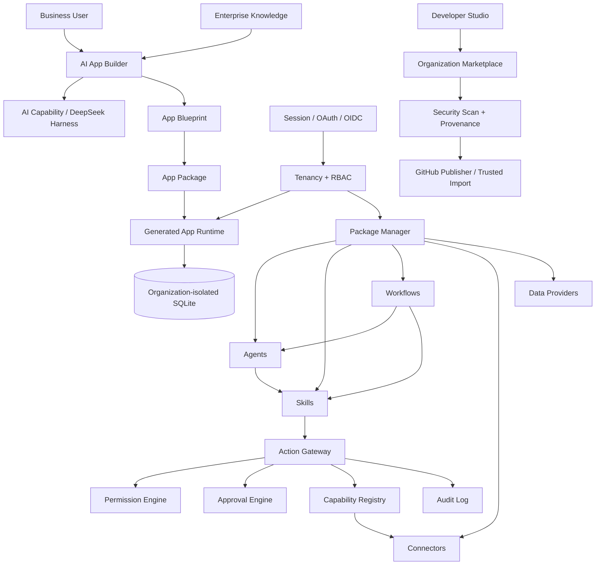

# Open Enterprise AI Platform (OEAP)

> Build enterprise software with AI — by describing the business, not by starting from code.

**OEAP 1.0.0-rc.1** is a self-hosted, open-source enterprise AI application platform. It turns business requirements into real applications, then provides the tenancy, data, identity, package, security and operations layers required to keep those applications usable inside an organization.

The 1.0 release-candidate line freezes the first stable Package/SDK contracts and is continuously validated by runtime, API, browser, container and supply-chain tests. It is suitable for controlled self-hosted evaluation. **1.0 General Availability remains gated on an independent external security review and deployment-owned production infrastructure/credentials.**

## From requirement to operating application

```text
Business requirement
→ AI analysis
→ App Blueprint
→ installable App Package
→ generated pages and SQLite data model
→ enterprise users / roles / app permissions
→ AI revision + version rollback
→ reusable Agent / Skill / Workflow / Connector packages
```

DeepSeek Harness is the current AI runtime adapter, but the platform is designed around provider-independent capabilities rather than one model vendor.

## What works in 1.0.0-rc.1

### AI application lifecycle

- Natural-language enterprise application generation
- Structured App Blueprints
- Blueprint → installable App Package
- Generated navigation and business pages
- SQLite-backed CRUD, search and pagination
- Enum, currency, dates, rich text, attachment, relation and JSON fields
- AI modification of existing applications
- Automatic version snapshots and rollback
- Enterprise knowledge retrieval injected into app generation/revision and Agent execution context

### Enterprise administration

- Multi-organization tenancy
- Owner / Admin / Manager / Member / Viewer plus custom roles
- Server-side RBAC
- Per-member application access scopes
- Organization-isolated application data and Developer/Marketplace assets
- Persistent Session identity
- GitHub OAuth, Google Workspace, Microsoft Entra ID and generic OIDC
- Stable provider-subject identity binding after first SSO match
- Invitation link/code lifecycle: expiration, revoke, single use and automatic session creation
- Organization branding and production login page
- Per-organization SMTP / Resend / webhook / manual mail delivery
- Encrypted Connector credential vault

### AI extensibility

OEAP supports six Package types:

| Type | Purpose |
| --- | --- |
| `app` | Complete business application |
| `agent` | Goal-oriented AI role |
| `skill` | Reusable business capability / SOP |
| `workflow` | Multi-step business process |
| `connector` | SaaS, MCP, API or local-system integration |
| `data-provider` | Enterprise/professional data source |

The platform includes Agent, Skill, Workflow and Connector runtimes; a capability registry; permission and approval engines; audit logging; and an Action Gateway for controlled execution.

### Developer Studio and Marketplace

- Generate Package scaffold, manifest, source entry, smoke test and README
- Validate Package structure
- Publish/unpublish to an organization-local Marketplace
- Enable/disable official Packages per organization
- Frozen Package Manifest 1.x compatibility rules
- TypeScript SDK 1.x contract and OEAP CLI
- GitHub Publisher using server-side credentials only
- Ed25519 Package signatures and SHA-256 provenance
- Trusted remote GitHub Package import
- Static security scan, file/path bounds and dependency checks before import
- Correct fail-closed SemVer dependency-range evaluation
- Publisher fingerprint trust policy
- Imported remote source is **not automatically executed**

### Data and operations

- File/attachment center
- Enterprise knowledge base / retrieval context
- Operations history and error tracking
- AI call/activity statistics
- Approval request / approve / reject / cancel lifecycle
- Tenancy and permission audit data
- Runtime persistence consistently rooted under configurable `OEAP_DATA_DIR`

### Production deployment

- Development and Production modes are explicitly separated
- Production rejects spoofed client identity headers
- Production requires authenticated Session identity
- Local Development login is hard-disabled in Production
- Brand-aware authentication gate
- Production public Web/API URLs require HTTPS
- Production CORS fails closed and rejects wildcard origins
- `/health` liveness and `/ready` readiness endpoints
- Deployment & Security readiness dashboard
- Docker multi-stage build
- Docker Compose
- Nginx reverse proxy and security headers/CSP
- Configurable persistent `OEAP_DATA_DIR`
- Backup and restore scripts
- Tag-driven GitHub Release workflow with RC prereleases

## Architecture



More detail: [docs/architecture.md](docs/architecture.md)

## Repository layout

```text
apps/
  api/                  Fastify platform API
  web/                  React/Vite enterprise workspace
  cli/                  OEAP command-line client

packages/
  package-spec/         Package contracts
  sdk/                  TypeScript client SDK
  package-manager/      Runtime Package lifecycle
  capability-registry/  Capability-provider resolution
  connector-runtime/    Connector abstraction
  permission-engine/    Policy evaluation
  approval-engine/      Human approval primitives
  audit-log/            Execution audit
  action-gateway/       Permission → approval → connector → audit
  skill-runtime/        Skill runtime
  agent-runtime/        Agent runtime
  workflow-engine/      Workflow runtime
  harness-adapter/      DeepSeek Harness adapter
  app-builder/          AI Blueprint generation/revision
  app-package-builder/  Blueprint → App Package
  app-installer/        App installation
  data-runtime/         Generated app data runtime
  official/             Official example Packages
```

## Local development

Requirements:

- Node.js 24+
- pnpm 11.7.0 through Corepack
- Optional DeepSeek Harness checkout for live AI generation

```bash
git clone https://github.com/Buer5460/open-enterprise-ai-platform.git
cd open-enterprise-ai-platform
corepack pnpm install
./scripts/start-local.sh
```

Open:

```text
http://127.0.0.1:5173/
```

The local startup script builds the workspace and launches the platform in development mode with the local Owner identity.

## Production deployment

Start with:

- [docs/deployment.md](docs/deployment.md)
- [docs/production-checklist.md](docs/production-checklist.md)
- [docs/release-readiness.md](docs/release-readiness.md)
- [.env.example](.env.example)

Typical container deployment:

```bash
cp .env.example .env
# Edit production-owned values and secrets outside source control.
docker compose up -d --build
```

Check:

```text
GET /health   # process liveness
GET /ready    # production readiness
```

## Package security

OEAP treats third-party extensions as a software supply-chain boundary. Remote imports must pass file/path limits, static security checks, content-digest verification, Ed25519 signature verification, trusted publisher fingerprint validation and fail-closed dependency checks before entering an organization Marketplace.

See [docs/package-supply-chain.md](docs/package-supply-chain.md).

## Security model

- Secrets belong in environment configuration or the encrypted Connector vault, never Package source.
- Production identity is Session-based and cannot be selected by client headers.
- Production local bootstrap login cannot be re-enabled by a mistaken environment override.
- First GitHub enterprise binding requires a verified GitHub email; subsequent SSO uses stable provider-subject binding.
- Organizations, application data, knowledge, files and local Package assets are isolated server-side.
- Remote Package import does not automatically execute imported code.
- High-risk domains still require domain-specific controls and independent review.

See [SECURITY.md](SECURITY.md).

## Tests and CI

```bash
corepack pnpm build
corepack pnpm test
```

CI additionally performs a built-API end-to-end test, starts a real headless Chrome browser to render/navigate core workspace pages and detect uncaught runtime exceptions, validates shell scripts and Docker Compose, then builds both production container targets.

Live AI-provider calls are intentionally excluded from public CI because they require an external runtime checkout and private provider credentials.

## Versioning

Current platform version: **1.0.0-rc.1**.

`1.0.0-rc.1` represents completed internal engineering/compatibility stabilization, not 1.0 GA security certification. See [CHANGELOG.md](CHANGELOG.md), [ROADMAP.md](ROADMAP.md) and [docs/release-readiness.md](docs/release-readiness.md).

## Contributing

See [CONTRIBUTING.md](CONTRIBUTING.md). Security reports should follow [SECURITY.md](SECURITY.md).

## License

Apache License 2.0. See [LICENSE](LICENSE).
