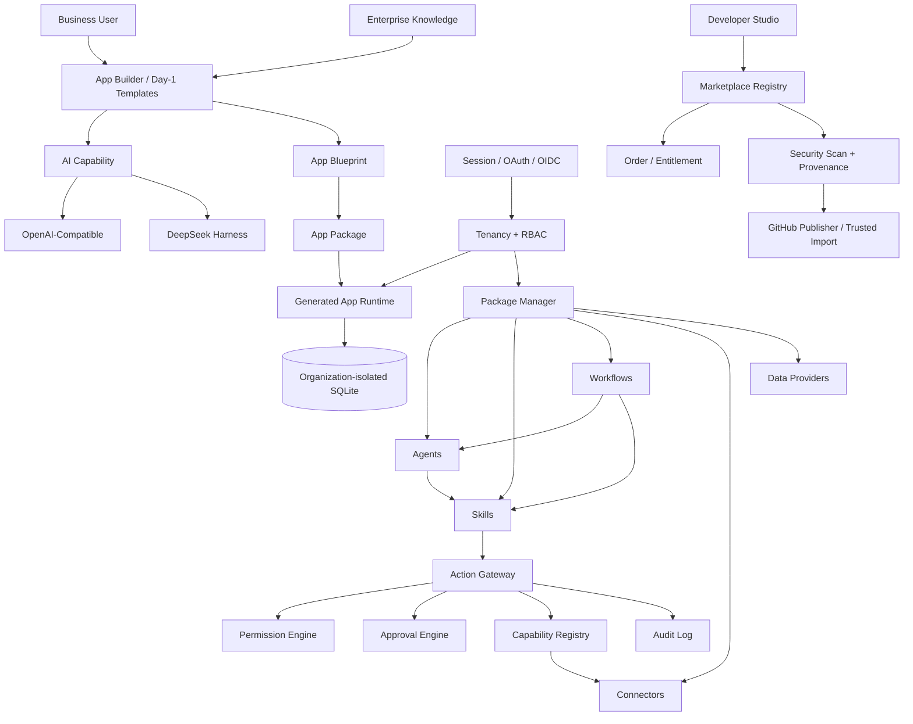

# Open Enterprise AI Platform (OEAP)

> Build and operate enterprise software from business requirements — with AI when useful, without making AI a prerequisite for day-one operations.

**Current development line: `1.1.0-alpha.1`.**

**Stable review baseline: `1.0.0-rc.2`.** The 1.0 RC line freezes the first stable Package/SDK contracts and remains the recommended baseline for independent security review. 1.0 General Availability still requires an independent external security review and deployment-owned production infrastructure/credentials.

OEAP is a self-hosted, open-source enterprise AI application platform. It combines an AI App Builder with tenancy, RBAC, data, knowledge, files, approvals, Package runtimes, Marketplace, security and deployment controls so generated applications can actually be used inside an organization.

## Five-minute start

See [docs/quickstart-5-minutes.md](docs/quickstart-5-minutes.md).

Local start:

```bash
git clone https://github.com/Buer5460/open-enterprise-ai-platform.git
cd open-enterprise-ai-platform
corepack enable
corepack pnpm install --frozen-lockfile
./scripts/start-local.sh
```

Open:

```text
http://127.0.0.1:5173/
```

AI is optional. Even with no AI Provider connected, the Day-1 templates can create real CRM, travel, payment-service ERP and project-management applications backed by SQLite.

## From requirement to operating application

```text
Business requirement / Day-1 template
→ App Blueprint
→ installable App Package
→ generated pages and SQLite data model
→ real business data
→ enterprise users / roles / app permissions
→ files / knowledge / approvals / operations
→ optional AI revision + version rollback
→ reusable Agent / Skill / Workflow / Connector packages
```

## 1.1 Day-1 usability line

The 1.1 development line focuses on making OEAP usable by ordinary business teams rather than only technically complete.

### Start without AI

- CRM, travel-agency, payment-service ERP and project/task templates
- One-click application creation
- Real generated business pages and SQLite databases
- CRUD, search and pagination
- Server-side field validation
- Enum, currency, date/time, rich text, attachment, relation and JSON fields

### Bring existing data

- CSV / JSON import and export
- Dry-run validation before writing
- Chinese field-label support
- Required/enum/number/integer/boolean/JSON/relation validation
- Unknown-column rejection
- CSV formula-injection hardening
- Transactional batch import: all rows commit or the whole batch rolls back
- Business-data overview across applications the current member can access

### Daily workspace

- Search applications and business entities
- Favorites
- Recently used applications
- Personal application folders/categories
- Smart, recent, name and folder sorting
- Preferences persist server-side by organization/member
- Application archive and restore without deleting the application database

### Multi-provider AI Runtime

OEAP exposes provider-independent capabilities such as `ai.generate`.

Supported runtime paths in 1.1:

- **DeepSeek Harness** — local/private runtime adapter
- **OpenAI-Compatible API** — OpenAI, DeepSeek API, newAPI, enterprise gateways and compatible `/chat/completions` services

Provider mode:

```text
auto | deepseek-harness | openai-compatible
```

Organization administrators can configure the compatible Provider in **AI Runtime**. API keys are stored in the encrypted Connector Vault and are not returned to the browser after saving.

### Agent / Package Marketplace foundation

The 1.1 line also adds the first hosted-style Marketplace foundation:

- registry protocol and Registry runtime
- official seeded listings
- discovery/read APIs and buyer-facing UI
- organization-scoped free acquisition
- order and entitlement data model
- organization-isolated acquisition state

The commerce layer is a foundation. A real third-party paid checkout/webhook provider must still be connected server-side before paid entitlements should be granted in production.

## Enterprise administration

- Multi-organization tenancy
- Owner / Admin / Manager / Member / Viewer plus custom roles
- Server-side RBAC
- Per-member application access scopes
- Organization-isolated application databases and Package assets
- Persistent Sessions
- GitHub OAuth, Google Workspace, Microsoft Entra ID and generic OIDC
- Stable external provider-subject identity binding
- Invitation expiry/revoke/single-use acceptance
- Organization branding and production login page
- Per-organization SMTP / Resend / webhook / manual invitation delivery
- Encrypted Connector credential vault

## AI extensibility

OEAP supports six Package types:

| Type | Purpose |
| --- | --- |
| `app` | Complete business application |
| `agent` | Goal-oriented AI role |
| `skill` | Reusable business capability / SOP |
| `workflow` | Multi-step business process |
| `connector` | SaaS, MCP, API or local-system integration |
| `data-provider` | Enterprise/professional data source |

The runtime includes:

- Package Manager
- Capability Registry
- Connector Runtime
- Permission Engine
- Approval Engine
- Audit Log
- Action Gateway
- Skill Runtime
- Agent Runtime
- Workflow Engine

## Developer Studio and Package supply chain

- Generate Package scaffold, manifest, source entry, smoke test and README
- Validate Package structure
- Publish/unpublish to organization-local Marketplace
- TypeScript SDK and OEAP CLI
- GitHub Publisher using server-side credentials only
- Ed25519 Package signatures and SHA-256 provenance
- Trusted remote GitHub Package import
- Static security scan and file/path/size bounds
- Dependency and fail-closed SemVer validation
- Publisher fingerprint trust policy
- Imported remote source is **not automatically executed**

See [docs/package-supply-chain.md](docs/package-supply-chain.md).

## Data, knowledge and operations

- File/attachment center
- Enterprise knowledge base / retrieval context
- Enterprise knowledge injected into App Builder and Agent context
- Operations history and failure tracking
- AI call/activity statistics
- Approval request / approve / reject / cancel lifecycle
- Tenancy and permission audit data
- Persistent runtime state rooted under configurable `OEAP_DATA_DIR`

## Production deployment and recovery

- Explicit Development / Production modes
- Production Session identity boundary
- Production Local Development login hard-disabled
- HTTPS public URL requirements
- Fail-closed Production CORS
- `/health` and `/ready`
- Deployment & Security readiness dashboard
- Docker multi-stage builds
- Docker Compose
- Nginx security headers/CSP
- Durable `OEAP_DATA_DIR`
- Hardened backup/restore with SHA-256 and archive validation
- Repository secret/runtime-state hygiene gate
- Production Preflight offline/live checks
- Tag-driven GitHub Release workflow

Production Preflight understands both AI Provider paths and distinguishes core-platform readiness from optional AI readiness.

```bash
corepack pnpm preflight:production -- --env-file .env
corepack pnpm preflight:production -- --env-file .env --live
```

Deployment references:

- [docs/deployment.md](docs/deployment.md)
- [docs/production-checklist.md](docs/production-checklist.md)
- [docs/release-readiness.md](docs/release-readiness.md)
- [docs/threat-model.md](docs/threat-model.md)
- [docs/security-review-checklist.md](docs/security-review-checklist.md)
- [.env.example](.env.example)

## Architecture



More detail: [docs/architecture.md](docs/architecture.md)

## Repository layout

```text
apps/
  api/                  Fastify platform API
  web/                  React/Vite enterprise workspace
  cli/                  OEAP command-line client

packages/
  package-spec/         Package contracts
  sdk/                  TypeScript client SDK
  package-manager/      Runtime Package lifecycle
  marketplace-registry Marketplace registry runtime
  capability-registry/ Capability-provider resolution
  connector-runtime/    Connector abstraction
  permission-engine/    Policy evaluation
  approval-engine/      Human approval primitives
  audit-log/            Execution audit
  action-gateway/       Permission → approval → connector → audit
  skill-runtime/        Skill runtime
  agent-runtime/        Agent runtime
  workflow-engine/      Workflow runtime
  harness-adapter/      DeepSeek Harness adapter
  app-builder/          AI Blueprint generation/revision
  app-package-builder/  Blueprint → App Package
  app-installer/        App installation
  data-runtime/         Generated app data runtime
  official/             Official Packages and AI connectors
```

## Tests and CI

```bash
corepack pnpm build
corepack pnpm test
```

CI includes deterministic runtime/RBAC/auth/data/Marketplace tests, built-API E2E, real headless Chrome rendering/navigation, backup/restore security regression, repository hygiene scanning, Production Preflight regression, shell validation, Docker Compose validation and production API/Web container builds.

External live AI calls with real provider credentials are intentionally excluded from public CI. Compatible-provider behavior is tested against controlled mock servers.

## Versioning

Current development version: **1.1.0-alpha.1**.

Stable independent-review baseline: **1.0.0-rc.2**.

See [CHANGELOG.md](CHANGELOG.md), [ROADMAP.md](ROADMAP.md) and [docs/release-readiness.md](docs/release-readiness.md).

## Security

- Secrets belong in environment configuration or encrypted vaults, never Package source.
- Production identity is Session-based and cannot be selected by client headers.
- Production local bootstrap login cannot be re-enabled by a mistaken environment override.
- Organizations, application data, knowledge, files, Marketplace commerce state and local Package assets are isolated server-side.
- Remote Package import does not automatically execute imported code.
- Backups are integrity-checked and restored only after archive/path/type validation.
- CI rejects committed runtime-state/secrets and common credential patterns.

See [SECURITY.md](SECURITY.md) and [docs/threat-model.md](docs/threat-model.md).

## Contributing

See [CONTRIBUTING.md](CONTRIBUTING.md). Security reports should follow [SECURITY.md](SECURITY.md).

## License

Apache License 2.0. See [LICENSE](LICENSE).
