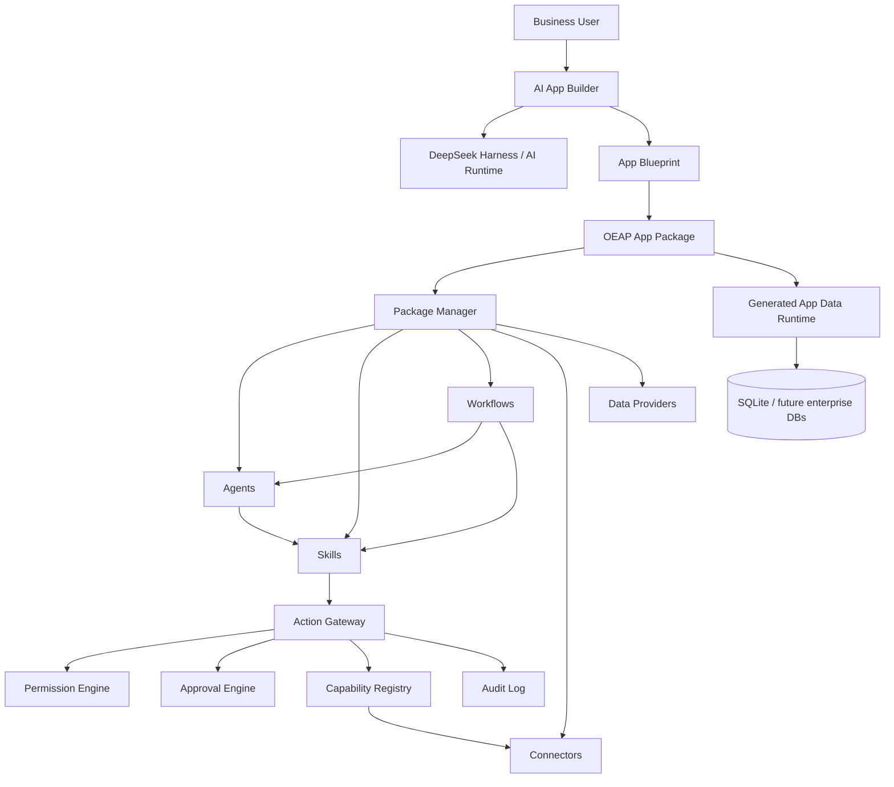

# Open Enterprise AI Platform (OEAP)

> Build enterprise software with AI — by describing the business, not by starting from code.

OEAP is an open platform for creating, running, extending, and sharing AI-native enterprise applications. It is designed for people who understand their business but may not be traditional software developers.

The platform turns business requirements into structured application blueprints, then composes apps from pluggable **Agents, Skills, Workflows, Connectors, Data Providers, and App Packages**.

## Why OEAP

Most AI tools stop at chat, code snippets, or isolated automations. OEAP is designed around a different goal:

**Business requirement → AI design → installable application → real data → reusable package ecosystem.**

Today, the project already demonstrates this end-to-end path with DeepSeek Harness as an AI runtime.

## What already works

- Natural-language enterprise app generation
- DeepSeek Harness adapter and provider-independent `ai.generate` capability
- AI App Builder that produces structured application blueprints
- Installable OEAP App Packages
- Dynamic application navigation generated from blueprints
- Agent, Skill, Workflow, Connector and Package runtimes
- Capability registry for provider-independent integrations
- Permission engine, approval engine and audit log
- Action Gateway: permission → approval → connector execution → audit
- SQLite-backed generated application data runtime
- Generic generated-app data API
- Dynamic enterprise application dashboard
- Working Growth Agent / first-touch workflow examples

## Core architecture



## Package model

OEAP defines six primary package types:

| Package type | Purpose |
| --- | --- |
| `app` | Complete enterprise application |
| `agent` | Goal-oriented AI role |
| `skill` | Reusable business capability / SOP |
| `workflow` | Multi-step business process |
| `connector` | External API, MCP, SaaS or local integration |
| `data-provider` | Professional or enterprise data source |

A key design rule is that **Skills depend on capabilities, not vendors**. For example, a lead-generation Skill should request capabilities such as `company.search` or `social.dm`, while a Connector decides whether that capability is provided by Apollo, an MCP server, another SaaS, or an internal system.

## Repository layout

```text
apps/
  api/                  Platform API
  web/                  Web dashboard / App Builder UI

packages/
  package-spec/         OEAP package contracts
  package-manager/      Install / enable / disable / uninstall packages
  capability-registry/  Capability-provider resolution
  connector-runtime/    Connector and MCP abstraction
  permission-engine/    Policy evaluation
  approval-engine/      Human approval requests
  audit-log/            Execution audit events
  action-gateway/       Unified execution gateway
  skill-runtime/        Skill registration and execution
  agent-runtime/        Agent registration and execution
  workflow-engine/      Workflow execution
  harness-adapter/      DeepSeek Harness adapter
  app-builder/          AI application blueprint generation
  app-package-builder/  Blueprint → installable App Package
  app-installer/        App Package installer
  data-runtime/         Generated app database runtime
  official/             Official example packages
```

## Development requirements

- Node.js 24+
- pnpm 11.7.0
- DeepSeek Harness checkout for AI-powered features

This repository intentionally keeps DeepSeek Harness external to the OEAP core. A common local layout is:

```text
OpenEnterpriseAI/
  deepseek-harness/
  open-enterprise-ai-platform/
  .dsh-dev/
```

## Install

```bash
git clone https://github.com/Buer5460/open-enterprise-ai-platform.git
cd open-enterprise-ai-platform
corepack pnpm install
```

Build the workspace:

```bash
corepack pnpm -r build
```

Run the API:

```bash
corepack pnpm --filter @oeap/api dev
```

Run the Web app in another terminal:

```bash
corepack pnpm --filter @oeap/web dev
```

Then open:

```text
http://127.0.0.1:5173/
```

## Current examples

The repository includes working examples for:

- Provider-independent AI generation
- Growth Agent
- Social first-touch Skill
- Growth first-touch Workflow
- AI-generated travel CRM / operations application
- AI-generated payment service ERP blueprint

## Vision

OEAP aims to become a platform where:

1. A business user describes what their company needs.
2. AI acts as product manager, architect and implementation assistant.
3. The platform creates an installable enterprise application.
4. Developers publish Skills, Agents, Workflows, Connectors and Apps.
5. Business experts can package and share domain knowledge without rebuilding the whole platform.
6. Packages can be open-source, privately shared, or distributed through a future marketplace.

## Project status

OEAP is currently **experimental / early-stage**. APIs and package specifications may change before the first stable release.

Do not use the current code for production financial transfers, live trading, or other high-risk operations without additional security, persistence, authentication, authorization, validation, and review layers.

## Contributing

Contributions are welcome. Please read [CONTRIBUTING.md](CONTRIBUTING.md) before opening a pull request.

For security issues, see [SECURITY.md](SECURITY.md).

See [ROADMAP.md](ROADMAP.md) for planned work.

## License

Apache License 2.0. See [LICENSE](LICENSE).
